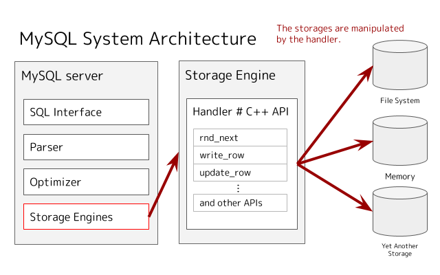
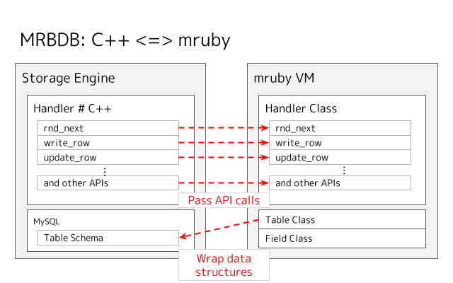

## :rocket: mrbdb - Dive into the MySQL internals with Ruby from scratch.

The **mrbdb** is an experimental implementation of the MySQL storage engine written in [mruby](https://github.com/mruby/mruby), and it aims to be a microscope which let us understand the MySQL internals and what happens on the database system behind our query like `SELECT * FROM somewhere` or something else (e.g., INSERT / UPDATE / DELETE).

### TL;DR :dash:

Here is an example implementation to run a `SELECT` query on the custom storage engine:

```rb
class Handler
  attr_reader :table
  attr_reader :called

  def initialize(table)
    @table = table
  end

  def rnd_init
    puts 'Handler#rnd_init'

    @called = false
    return 0
  end

  def rnd_end
    puts 'Handler#rnd_end'

    return 0
  end

  def rnd_next
    puts 'Handler#rnd_next'

    if not called
      @called = true
      table.each_field do |field|
        field.store('hello, mruby :-)')
      end
      return 0
    else
      HA_ERR_END_OF_FILE
    end
  end
end
```

And so yeah, we can bring the Ruby world to the MySQL internals. ;-)

```sql
mysql> install plugin mrbdb soname 'ha_mrbdb.so';
Query OK, 0 rows affected (0.01 sec)

mysql> create table hello.mruby (col text) engine=mrbdb;
Query OK, 0 rows affected (0.02 sec)

mysql> select * from hello.mruby;
Handler#rnd_init
Handler#rnd_next
Handler#rnd_next
Handler#rnd_end
+------------------+
| col              |
+------------------+
| hello, mruby :-) |
+------------------+
1 row in set (0.01 sec)
```

### :unicorn: System Architecture





### :whale: How to build

After cloning this repository, just type a `make` command to launch the development environment in the Docker based on the `library/mysql` image:

```
$ make

...

Successfully built d7d91c6b185c
Successfully tagged mrbdb_dev:latest
docker run \
                --rm \
                --name mrbdb_dev \
                -ti \
                -w /opt/build \
                -v /home/user/wrk:/opt/build/script \
                -v /home/user/wrk/mrbdb/src:/opt/mysql-server/storage/mrbdb \
                mrbdb_dev \
                bash
root@192f3c1b1233:/opt/build#
```

Then, you can find some bash scripts to try the custom storage engine on the MySQL server for development.

`./script/build.bash` is to build the custom storage engine:

```bash
root@192f3c1b1233:/opt/build# cat script/build.bash
cmake /opt/mysql-server -DDOWNLOAD_BOOST=1 -DWITH_BOOST=/tmp/boost
make -j4 mrbdb
```

`./script/install.bash` is to install the custom storage engine into the MySQL plugin directory:

```bash
root@192f3c1b1233:/opt/build# cat script/install.bash
cp /opt/build/plugin_output_directory/ha_mrbdb.so /usr/lib/mysql/plugin/
```

`./script/serve.bash` is to launch a MySQL server for the development:

```bash
root@192f3c1b1233:/opt/build# cat script/serve.bash
mysqld --user mysql --initialize
mysqld --user mysql --skip-grant-tables
```

So you can install your storage engine into the MySQL server by the following (it takes a few minutes):

```bash
root@192f3c1b1233:/opt/build# bash script/build.bash && bash script/install.bash
```

The below message will be shown if the build is success:

```
[100%] Linking CXX shared module ../../plugin_output_directory/ha_mrbdb.so
[100%] Built target mrbdb
```

And then, start MySQL server like the followings command:

```bash
root@192f3c1b1233:/opt/build# bash script/serve.bash &
[1] 6758
```

After few seconds, you will be able to enter the MySQL console such as the below:

```bash
root@192f3c1b1233:/opt/build# mysql
Welcome to the MySQL monitor.  Commands end with ; or \g.
Your MySQL connection id is 7
Server version: 8.0.14 MySQL Community Server - GPL

Copyright (c) 2000, 2019, Oracle and/or its affiliates. All rights reserved.

Oracle is a registered trademark of Oracle Corporation and/or its
affiliates. Other names may be trademarks of their respective
owners.

Type 'help;' or '\h' for help. Type '\c' to clear the current input statement.

mysql> 
```

### Install your custom storage engine

You can install the plugin by the `install plugin` command:

```sql
mysql> install plugin mrbdb soname 'ha_mrbdb.so' ;
Query OK, 0 rows affected (0.02 sec)
```

Here is an example query to use the storage engine:

```sql
mysql> create table hello.mruby (col text) engine=mrbdb;
Query OK, 0 rows affected (0.01 sec)

mysql> insert into hello.mruby values ("hello, mruby");
Query OK, 1 row affected (0.02 sec)

mysql> select * from hello.mruby;
+--------------+
| col          |
+--------------+
| hello, mruby |
+--------------+
1 row in set (0.00 sec)
```

### Examples

Please check `src/mrblib/handler.rb`. It has implementations for simple CRUD operations.

### :runner: TODO

- [x] CRUD
  - [x] SELECT
  - [x] INSERT
  - [x] UPDATE
  - [x] DELETE
- [ ] Indexes
- [ ] Transactions

### Links

If you want to know more about the MySQL storage engines, the below link would be helpful:

https://dev.mysql.com/doc/internals/en/custom-engine.html

### License

GPLv2
